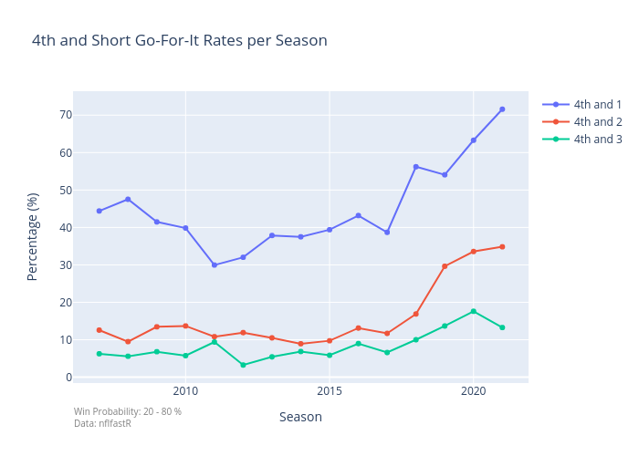
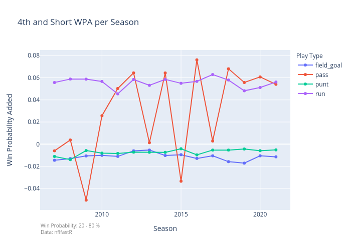
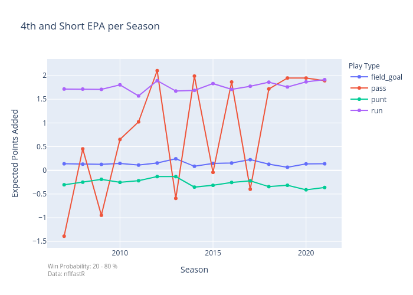
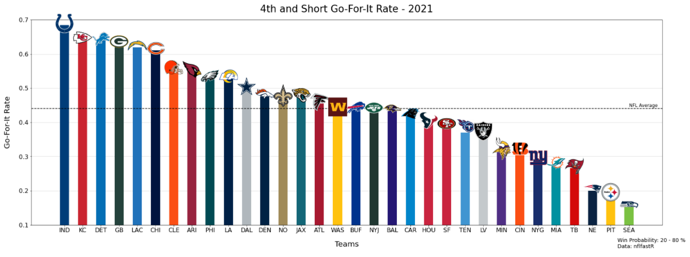

# NFL_4th_Down_Go-For-It_Project

## Medium Article

An in-depth story of this project can be found [here](https://medium.com/deep-dives-with-data/go-for-it-why-nfl-teams-are-going-for-it-on-4th-downs-more-than-ever-ae07dce63b2a).

## Motivation
As a football fan, I noticed a league-wide trend where it felt like more teams were going for it on 4th down. After the 2021 NFL regular season ended, I came across a [tweet](https://twitter.com/StatsbyLopez/status/1481096715235217413) from Michael Lopez who is the Director of Football Data and Analytics for the NFL. This sparked my interest in digging deeper into the numbers to find the league-wide trends in go-for-it rates. I wanted to also to find if there was a benefit to going-for-it in 4th and short situations as well as how often teams went for it in such situations in the 2021 season. Additionally, this gave me a great opportunity to work on my data visualization skills with interactive plots using plotly and plots with NFL team logos. 

## Code
The code written for this project can be found in this Jupyter Notebook:
```NFL 4th Down Go-For-It Project.ipynb```

Additionally, ```nfl_team_logos.csv``` contains the team logos of every team and the plots can be found in the plots folder.

## Data
The [data](https://github.com/nflverse/nflfastR-data) comes from nflfastR which has scraped NFL play-by-play data from the 1999 NFL season. Since I had no experience in working with nflfastR, I found a great Python tutorial from [@Deryck97](https://gist.github.com/Deryck97) which can be found [here](https://gist.github.com/Deryck97/dff8d33e9f841568201a2a0d5519ac5e).


## League-Wide Go-For-It Rate in 4th-and-Short opportunities
I wanted to first re-create the plot that Michael Lopez tweeted out. I used data from the past 15 seasons starting from the 2007 season. I did this by isolating the data with 4th-and-1, 4th-and-2, and 4th-and-3 opportunies. I then grouped by season and took the probability of going-for-it by dividing the number of passes and runs over the total sum of fourth-and-short plays. I also filtered the data using win probability in order to keep the plays in which the game is competitive at that point. Here is the final result and an interactive version of the plot can be found [here](https://chart-studio.plotly.com/~slingam00/36/#/):



We see a dramatic increase in teams going-for-it on 4th-and-1 in this past season at almost twice the rate as four seasons prior. We also see that more teams went-for-it on 4th-and-2 in 2021 than teams went-for-it in 2011 on 4th-and-2. This shows that teams are being more aggressive in trying to keep a drive going in order to maximize the number of points they can score in a given drive.

## WPA/EPA plots

The next thing that I wanted to look at was if over these past fifteen seasons, were teams having success in going-for-it in these 4th-and-short situations. In order to calculate this, I used WPA (Win Probability Added) and Expected Points Added (EPA). WPA describes the amount in which a team's win probability in a game increased or decreased based on a given play. EPA is based on EP (Expected Points) which attempts to quantify the expected points of scoring based on a given down and distance since not all yards gained are the same. EPA measures how well a team performs relative to the expectation. From [The 33rd Team](https://www.the33rdteam.com/epa-explained/), "say the Chiefs start with the ball first-and-10 from their own 25-yard line, where its expected points would be about 1.06. If Patrick Mahomes throws a 15-yard completion, making it first-and-10 on the KC 40-yard line, where the expected points is now 1.88, the EPA of that play would be 1.88 – 1.06 or 0.82".

Given these two metrics, I took the median WPA and EPA per season of 4th-and-short plays and grouped by the different play types of pass, run, field goal, and punt. Here are the plots and the interactive versions can be found for [WPA](https://chart-studio.plotly.com/~slingam00/38/#/) and [EPA](https://chart-studio.plotly.com/~slingam00/38/#/).





From these plots which show a similar trend, we see that kicking a field goal and punting in 4th-and-short situations consistently produces a negative average WPA and EPA. Whereas, running the football in such situations consistently produces on average, an increase of about 5% in win probability and around 1.8 expected points. While the result in passing the football in these situations fluctuate, it has shown to produce positive WPA and EPA in the past 4 seasons which is significantly better than punting or kicking a field goal given where a team is on the field.

## Team Fourth-and-Short Go-For-It Rate

The last thing that I wanted to do was find out how frequent teams went for it in 2021. In order to get this information, I summed the number of times a team passed or ran in 4th-and-short situations and divided it by the number of plays a team ran in 4th-and-short situations. I then used the Python tutorial referenced earlier to get team logo and and team color information to make a bar chart. Here is the result:



As seen from the chart, the Indianapolis Colts went-for-it at the highest rate at about 68% of the time and the Seattle Seahawks went-for-it at the lowest rate at about 15% of the time. While teams are more aggressive than ever in going-for-it, there are still NFL teams that are far too conservative and costing their team valuable opportunities to increase their scoring opportunities and score given what the data suggests. In the future, it will be interesting to see how many NFL head coaches will be open to being more aggressive on 4th down. We've already seen Chargers Head Coach [Brandon Staley](https://www.youtube.com/watch?v=kLEoqnSe2kE) and Ravens Head Coach [John Harbaugh](https://www.youtube.com/watch?v=RszFYKsny1c) be accepting of using analytics in enhance their respective football teams' performance. The question is, will more head coaches do the same?
